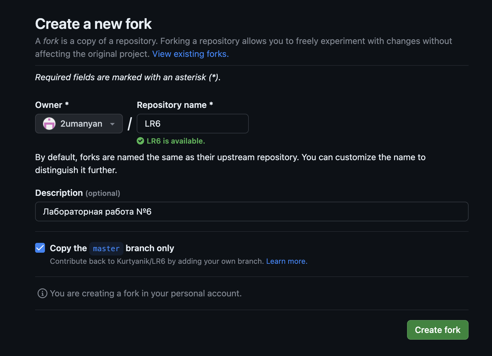
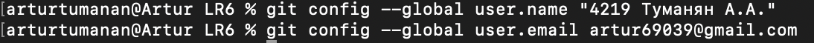
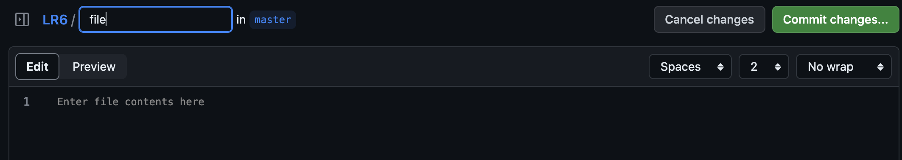
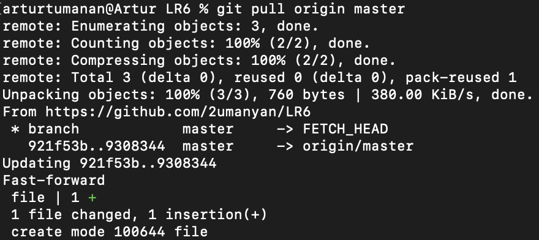
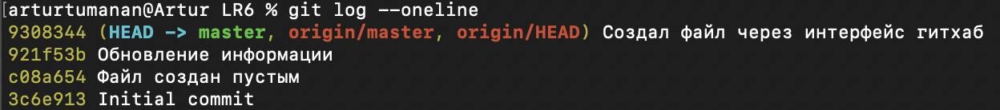
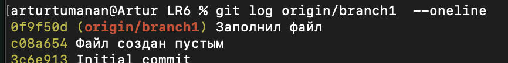

# LR6

# Лабораторная работа №6

## Цель работы

Изучение базовых возможностей системы управления версиями, опыт работы с Git Api, опыт работы с локальным и удаленным репозиторием.

## Ход работы

1. Создание копии в личное хранилище из https://github.com/Kurtyanik/LR6/.

2. Настройка клиента git, путем ввода имени пользователя и email.

3. Клонирование личного удаленного репозитория на компьютер.

4. Добавление файла через интерфейс GitHub.

5. Подтягивание изменение в локальный репозиторий.

6. История операций для ветки master.

7. История операция для ветки branch1.

