# LR6

Лабораторная работа №6

Настройка имени и почты

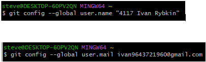

Переход в папку GIT

Клонирование репозитория

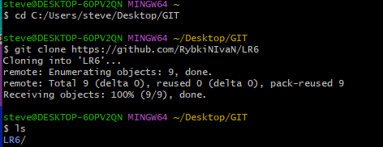

Обновление изменений

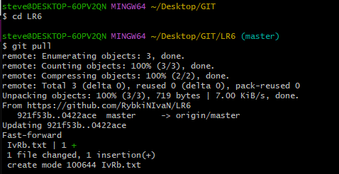

Просмотр истории

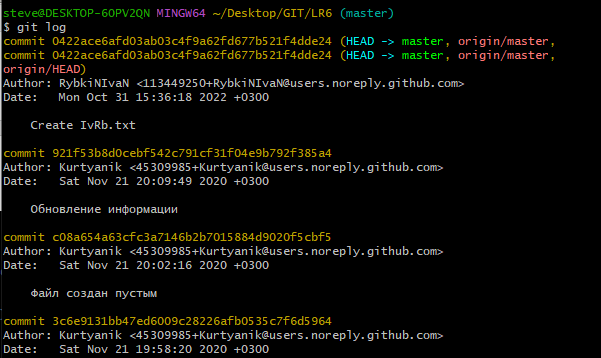

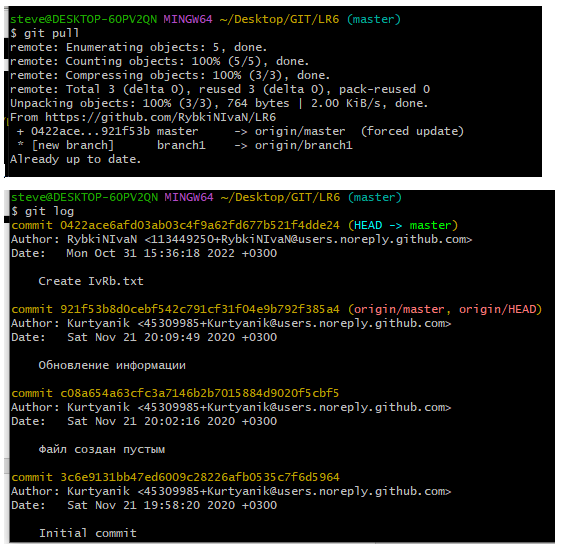

Переход к ветке branch1

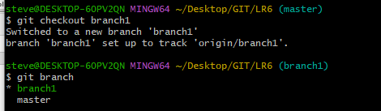

Просмотр истории

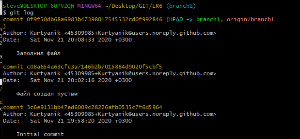

Слияние в один файл

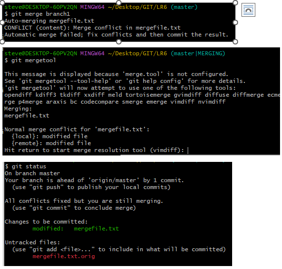

Удаление побочной ветви

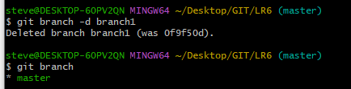

Добавление index.html

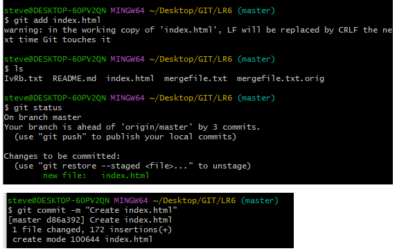

Добавление ABS.txt

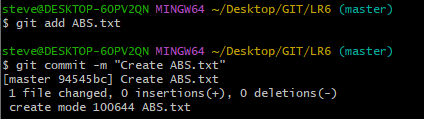

Просмотр истории

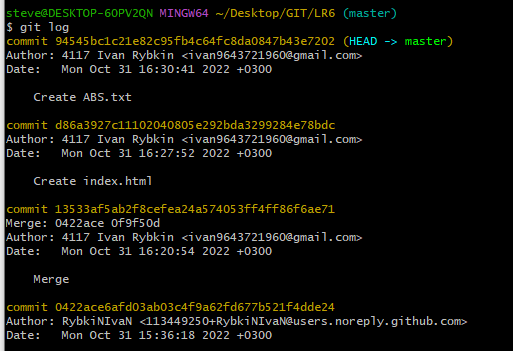

Откат коммита

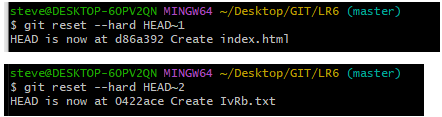

История операций

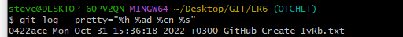

