# LR6

Лабораторная работа №6
Цель лабораторной работы: изучение базовых возможностей системы управления версиями, опыт работы с Git Api, опыт работы с локальным и удаленным репозиторием.

Порядок выполнения работы:

1. Создать аккаунт на сайте GitHub

   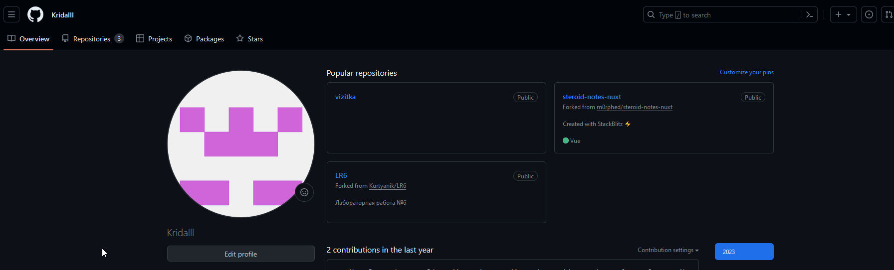

2. Сделать копию в личное хранилище из https://github.com/Kurtyanik/LR6/ (Fork).

   

3. Установить Git (https://git-scm.com/)

4. После установки настроить клиент git, введя имя пользователя и email.

   Настройка производится с использованием команд git config --global user.name и git config --global user.email

   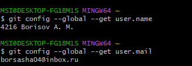

5. Клонировать свой личный удалённый репозиторий на компьютер.

   Клонирование удаленного репозитория делается, используя команду git clone.

   

6. Добавить файл через интерфейс GitHub. Подтянуть изменения в локальный репозиторий.

   Для дальнейшей работы с файлами осуществляется переход в директорию LR6 командой cd LR6.

   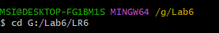

7. Получить историю операций для каждой из веток.

   Просмотр истории операций ветки master, используя команду git log.

   
   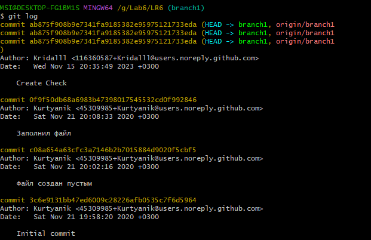

8. Просмотреть последние изменения.

   Просмотр последних изменений с помощью команды git log -p.

   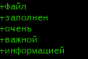

9. Выполнить слияние в ветку master, разрешив конфликт (можно использовать специальные редакторы или графический интерфейс git).

   

   Так как файл mergefile.txt не отслеживается, используется команда git status для отображения состояния рабочего каталога.

   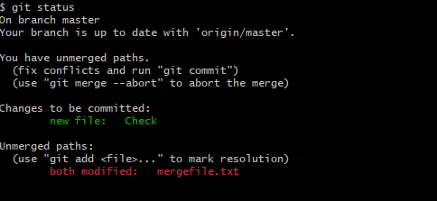

   Добавление файла mergefile.txt с помощью команды git add.

   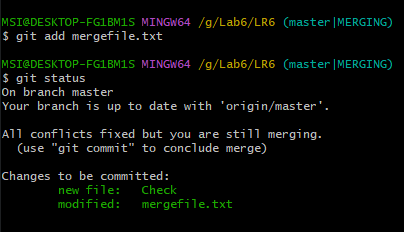

   Конфликт разрешен, с помощью команды git commit -m добавляется коммит со словом "Branch"

   

10. Удалить побочную ветку после успешного слияния.

    Удаление побочной ветки осуществляется при помощи команды git branch -d.

    

11. Сделать изменения и зафиксировать их, оставляя комментарии, несколько раз.

    Для создания комментариев в текстовом файле используется команда echo "текст" > имя_файла.txt.

    
    
    
    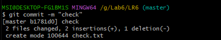
    Просмотр комментариев, используя команду git log.

    

12. Сделать откат коммита.

    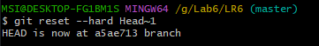

13. Создать ветку для отчёта.

    

14. Начать оформлять отчёт в файле README.md

    ВЫ сейчас находитесь в данном файле

15. Получить историю операций в форматированном виде (сокращённый хэш + дата + имя автора + комментарий). Добавить её в отчёт и сделать финальную фиксацию изменений.

    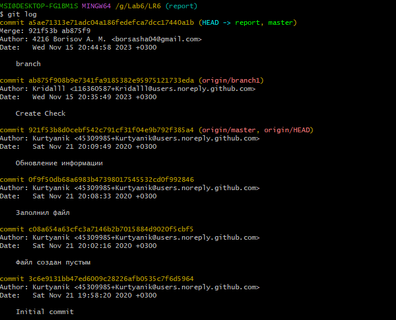

16. Отправить локальные изменения в сетевое хранилище GitHub.

    Отправка изменений осуществляется командой git push.

    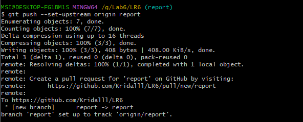
