# 
LR6

### 
Лабораторная работа №6

**Цель работы:** _изучение базовых возможностей системы управления версиями, опыт работы с Git Api, опыт работы с локальным и удаленным репозиторием._

**Ход работы.**

1. Создадим аккаунт на `GitHub` _(Рис. 1)._
   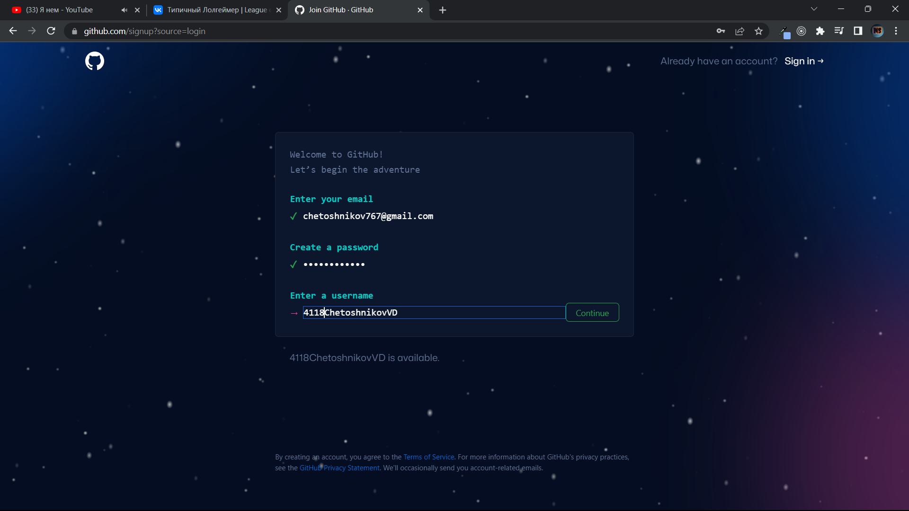

##### 
_Рисунок 1. Создание аккаунта._

2. Перейдем в предоставленный репозиторий _(Рис. 2)_ и форкнем его. _(Рис. 3)_

   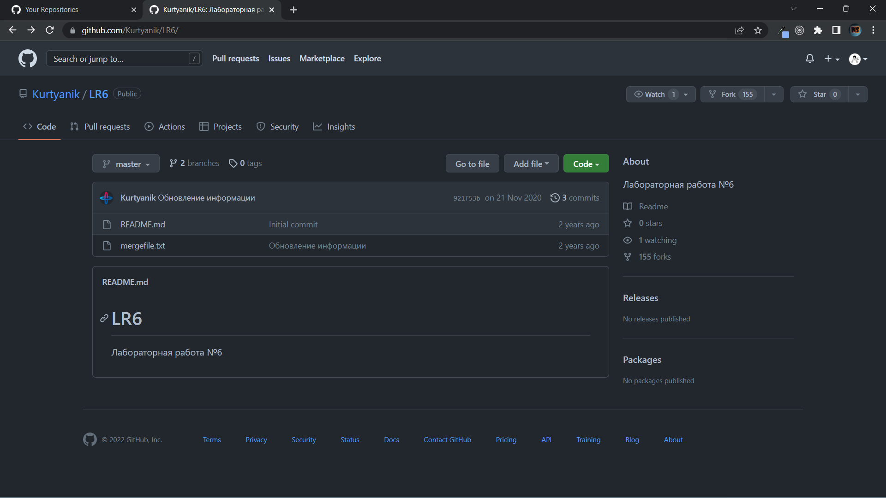

##### 
_Рисунок 2. Переход в репозиторий._

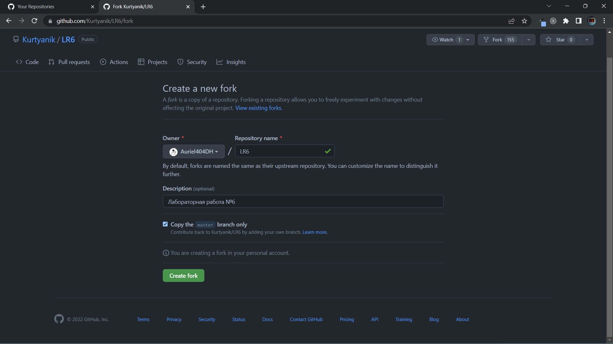

##### 
_Рисунок 3. Fork._

3. Откроем `VS Code` и клонируем нам репозиторий. _(Рис. 4)_
   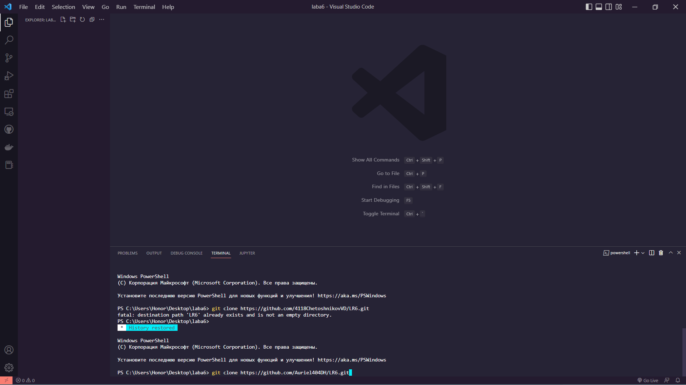

##### 
_Рисунок 4. Клонирование репозитория._

4. При помощи команды `"git add ."` сделаем stage файлов. _(Рис. 5)_
   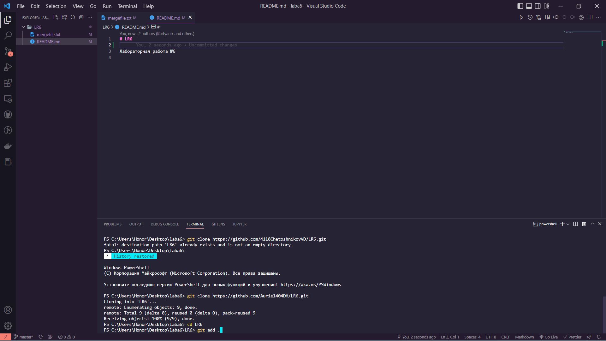

##### 
_Рисунок 5. Stage файлов._

5. После этого сделаем `commit`. Подтянем изменения в наш репозиторий, предварительно оставив комментарий. _(Рис. 6)_ После чего пуллим.

   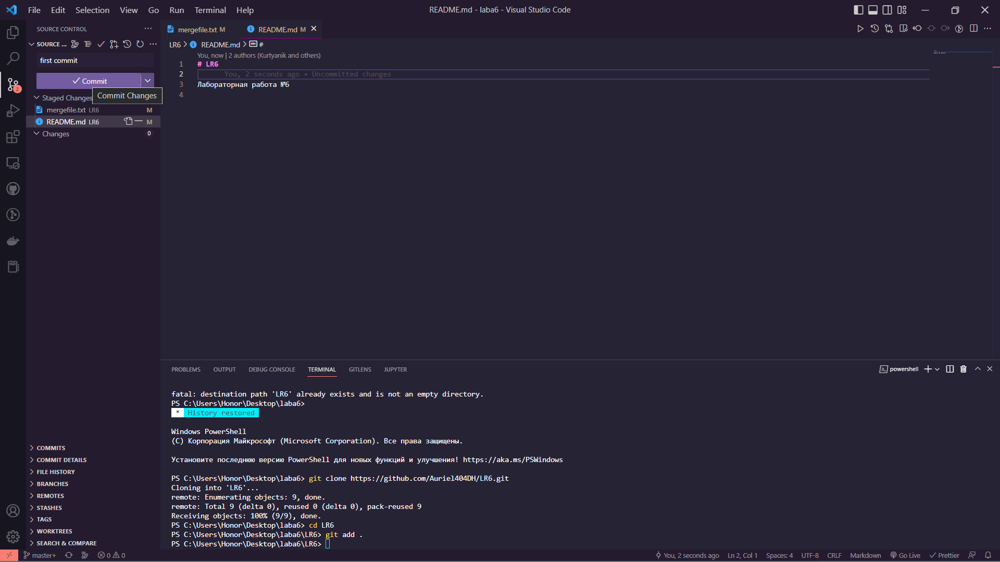

##### 
_Рисунок 6. Commit._

6. При помощи `"git log"` запрашиваем список изменений ветки. _(Рис. 7)_
   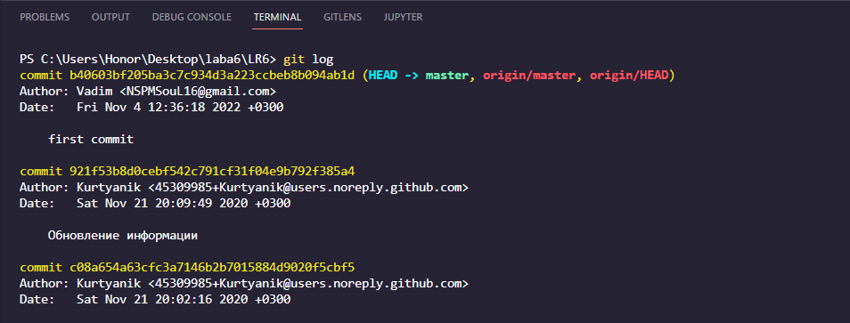

##### 
_Рисунок 7. Git log._

7. Посмотрим последние изменения. _(Рис. 8)_ Для наглядности откроем их в браузере.
   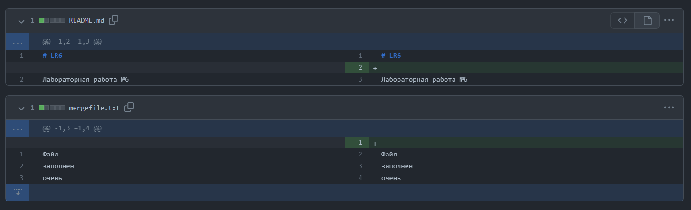

##### 
_Рисунок 8. Изменения._

8. Сошьем нашу ветку с веткой `master`. Для этого перейдем в ветку `master` при помощи `"git checkout master"`. Затем воспользуемся командой `"git merge myBranch"` _(Рис. 9)_. Решим конфликт при помощи встроенного в `VS Code` инструмента Git. _(Рис. 10)_
   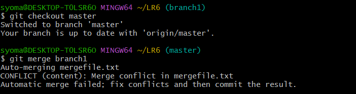

##### 
_Рисунок 9. git merge._

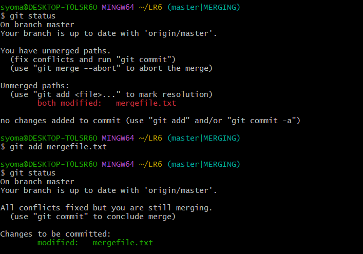

##### 
_Рисунок 10. Конфликт._

9. После удачного слияния удалим ненужную ветку. _(Рис. 11)_
   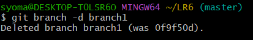

##### 
_Рисунок 11. Удаление ветки._

10. Удалим поставленный `+` и зафиксируем изменения с соответствующими комментари-ями. _(Рис. 12)_
    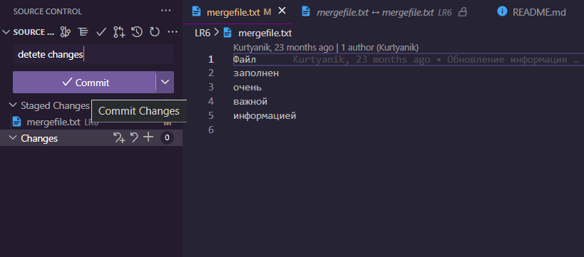

##### 
_Рисунок 12. Еще один commit._

11. Добавим текст и зафиксируем изменения еще раз. _(Рис. 13)_
    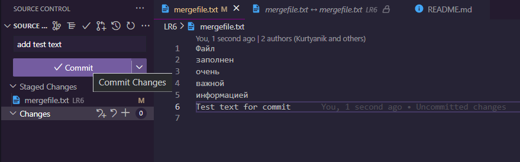

##### 
_Рисунок 13. Еще один commit._

12. Сделам откат последнего коммита при помощи `"git revert"`._(Рис. 14)_ Данная команда создаст новый коммит без последних внесенных изменений. Добавим комментарий.
    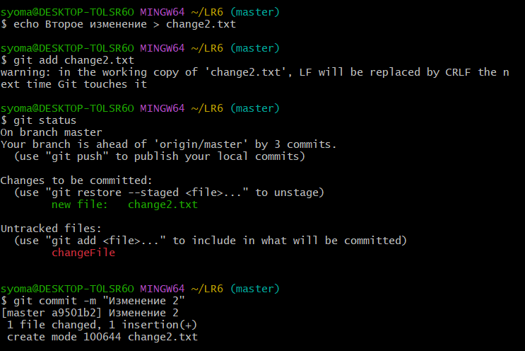

##### 
_Рисунок 14. git revert._

13. Создадим новую ветку для отчета. _(Рис. 15)_
    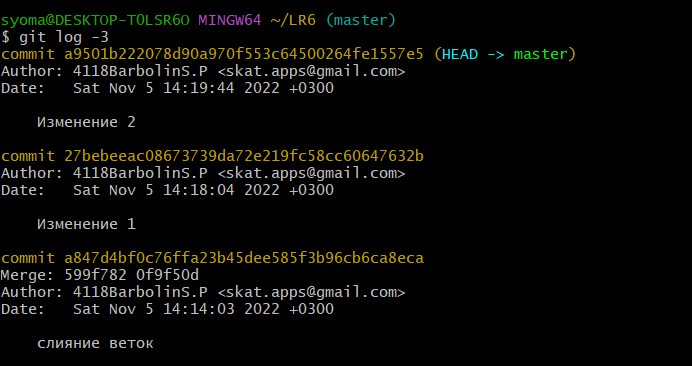

##### 
_Рисунок 15. git revert._

14. Создадим папку `"screens"`, в которую положим все скриншоты. Запросим логи в кратком формате._(Рис. 16)_ Оформим отчет.

    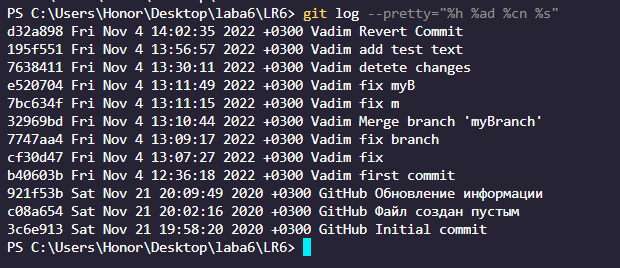

##### 
_Рисунок 19. Краткие логи._

15. Сделаем финальный коммит и зальем на GitHub.

**Вывод:** _в ходе лабоораторной работы я вспомнил базовые методы работы с git: git add, git commit, git clone, git log и пр. Научился работать с синтаксисом Markdown._
