# LR6

# Лабораторная работа №6

## Цель работы

Изучение базовых возможностей системы управления версиями, опыт работы с Git Api, опыт работы с локальным и удаленным репозиторием.

## Ход работы

1. Создание копии в личное хранилище из https://github.com/Kurtyanik/LR6/.

2. Настройка клиента git, путем ввода имени пользователя и email.

3. Клонирование личного удаленного репозитория на компьютер.

4. Добавление файла через интерфейс GitHub.

5. Подтягивание изменение в локальный репозиторий.

6. История операций для ветки master.

7. История операция для ветки branch1.

8. Последние изменения.
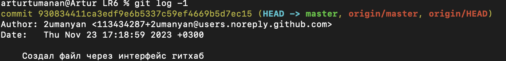

9. Попытка слияния ветки branch1 в ветку master.
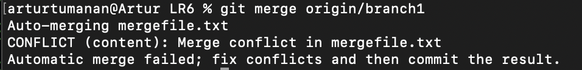

10. Изменения произошедние в файле mergefile.txt после попытки слияния.
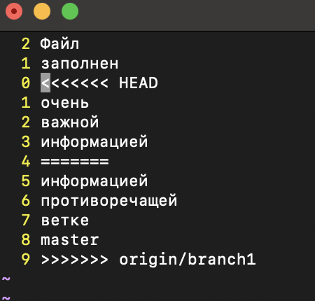

11. Отредактированное содержимое файла для разрешения конфликта.
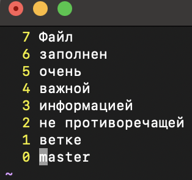

12. Коммит файла.
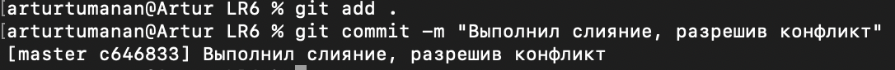

13. Удаление побочной ветки после успешного слияния.
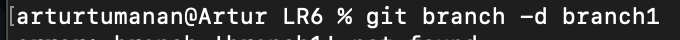

14. Создание нескольких коммитов.
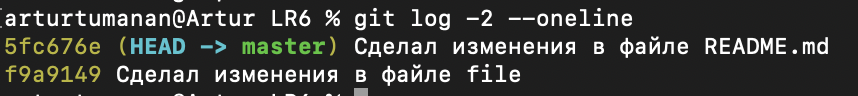

15. Откат коммита.
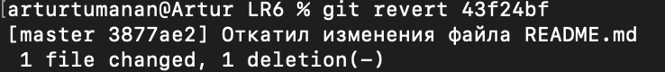

16. Создание ветки для отчета.
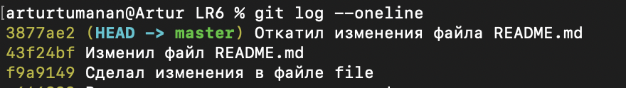

17. История коммитов.
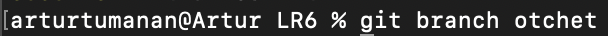

## История операций
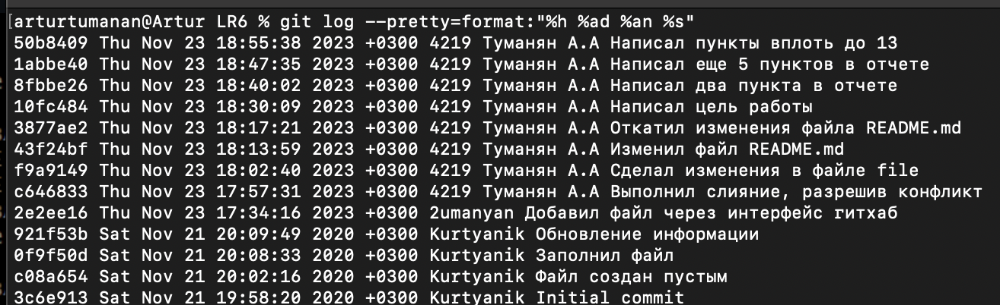

## Вывод

Изучены базовые возможности системы управления версиями, получен опыт работы с Git Api опыт работы с локальным и удаленным репозиторием.

