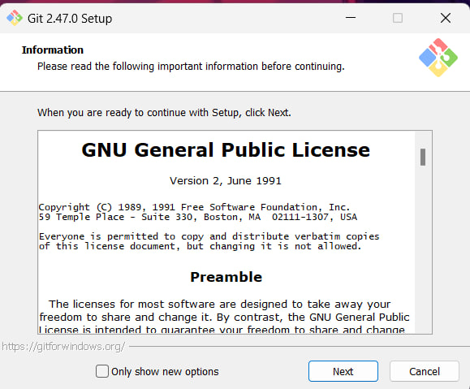
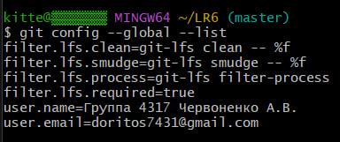
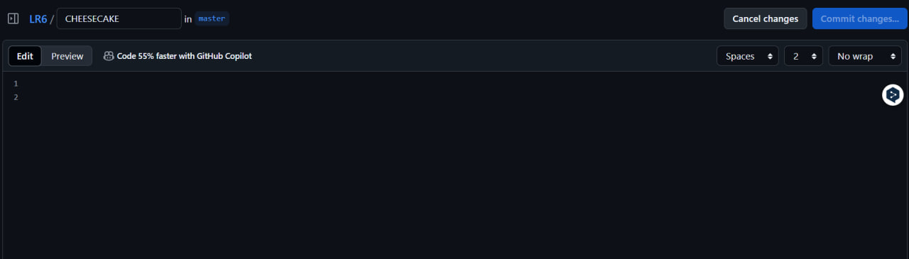
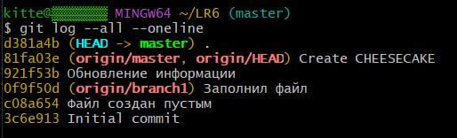
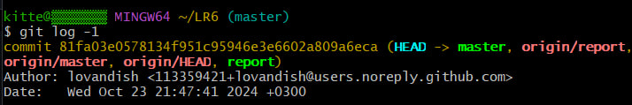

# LR6
Лабораторная работа №6

# Отчет по работе с Git

## 1. Создание форка
Сделана копия в личное хранилище из https://github.com/Kurtyanik/LR6/

## 2. Установка Git
*Скриншот с процессом установки git*  


## 3. Изменение имени пользователя
Команда для изменения имени пользователя:

```bash
$ git config --global user.name "Группа 4317 Червоненко А.В."
```
Команда для изменения почты пользователя:

```bash
$ git config --global user.email "doritos7431@gmail.com"
```
*Результаты изменения имени и почты пользователя*  


## 4. Клонирование репозитория

```bash
$ git clone https://github.com/lovandish/LR6
```

## 5. Добавление нового файла
*Скриншет с добавлением нового файла*


## 6. Добавление изменений в локальный репозиторий

```bash
$ git pull
```

## 7. Получение данных для каждой из веток

```bash
$ git log --all –oneline
```

*Результат работы команды*



## 8. Просмотр последних изменений

```bash
$ git log -1
```

*Результат работы команды*



## 9. Решение конфликта и слияние веток

```bash
$ git checkout master
$ git merge branch1
```
Решение конфликта с помощью редактора nano путем замены содержимого mergefile.txt в ветке branch1

## 10. Удаление побочной ветки после слияния

```bash
$ git branch -d branch1
```

## 11. Откат коммита
Посмотреть логи с помощью команды:

```bash
$ git log --all –oneline
```

Откат к предыдущему коммиту:

```bash
$ git reset --hard 06c6aec
```

## 12. Создание ветки для отчета

```bash
$ git checkout -b report
```

## 13. Получение истории операций в форматированном виде

```bash
$ git log --pretty=format:"%h %ad %an %s" --date=short
```

## 14. История операций
Список истории операций:
+ 81fa03e 2024-10-23 lovandish Create CHEESECAKE

