# Лабораторная работа №6
Создаётся копия (Fork) репозитория и клонируется удаленный репозиторий на компьютер командой `git clone <url>`

Добавляется файл через интерфейс GitHub

Подтягиваются изменения из удаленного репозитория командой `git pull`

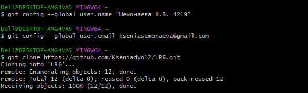

Получили историю операций из каждой ветки командой `git log`. Переключение веток с помощью `git checkout`

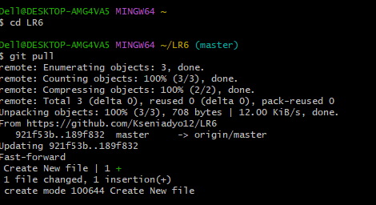
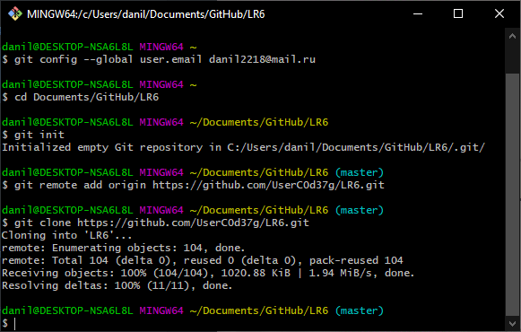

Выполняется слияние в ветку master командой `git merge <branch>`

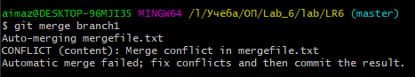

Происхдит конфликт, для решения вручную меняется содержимое файла

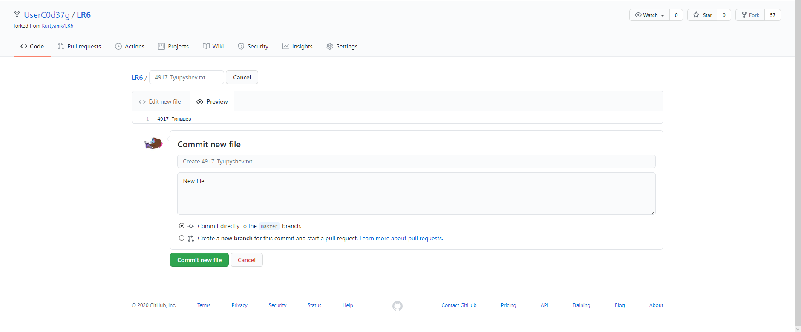
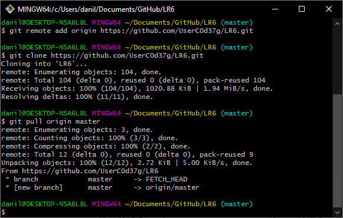

Для индексирования файла использовали `git add` и комита `git commit -m <message>` 

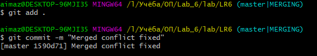

Затем необходимо удалить побочную ветку из локального репозитория `git branch -d <branch>` и удаленного репозитория `git push <url> --delete <branch>`

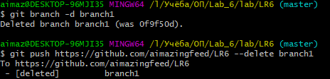

Делается несколько изменений и фиксируются с помощью `git add` и `git commit`

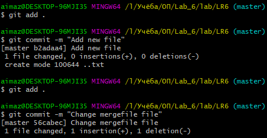

Необходимо сделать хард ресет коммита, для этого сделан специальный коммит, открыт лог и командой `git reset --hard <commit>` произведён откат до предыдущей версии

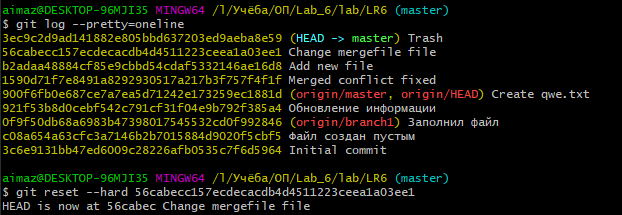

Создаётся новая ветка для отчета и производится переключение на нее `git checkout -b report`

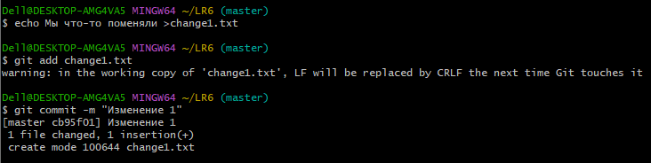
 
Пишется отчет в файле README.md, используя Markdown синтаксис.  

Получаем итоговую историю операций с помощью `git log`

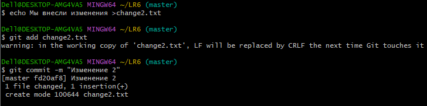

